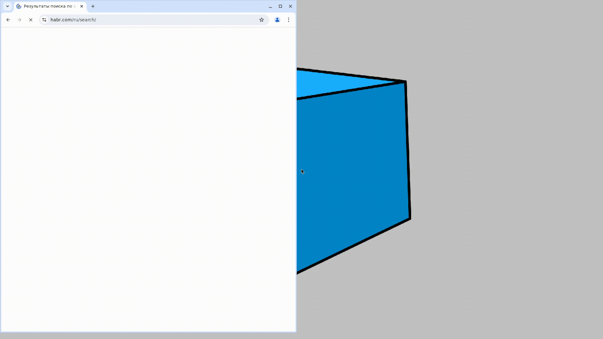
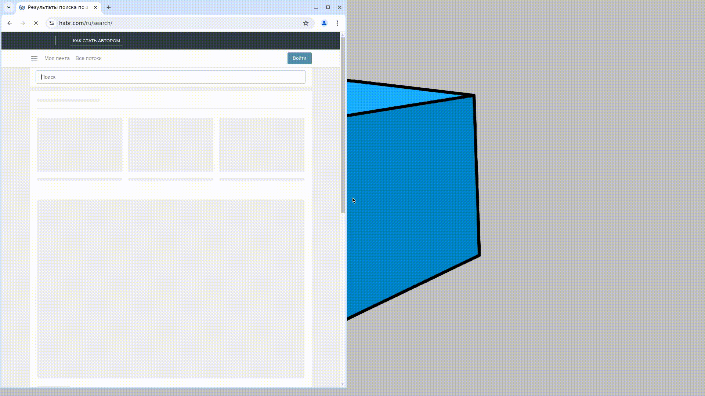

# Проект по автоматизации тестирования UI для сайта компании [Habr](https://habr.com/ru/)

🔎🎓💻 Хабр - это русскоязычный веб-сайт, представляющий собой платформу для публикации новостей, аналитических статей, мыслей и дискуссий в области информационных технологий, бизнеса и интернета. 

## Содержание:

- [Технологии и инструменты](#tools)
- [Тестовое покрытие](#cases)
- [Запуск тестов в Jenkins](#remoterun)
- [Allure отчёт](#report)
- [Уведомления в Telegram](#telegram)
- [Видео с примером запуска тестов в Selenoid](#video)

## Технологии и инструменты:

  

  

  

Автотесты для данного проекта написаны на <code>Java</code> с использованием фреймворка <code>Selenide</code>. При проектировании тестов применён паттерн <code>PageObject</code>.

В качестве фреймворка для запуска тестов используется <code>Junit5</code>, а в качестве сборщика проекта - <code>Gradle</code>.

Произведена настройка CI в <code>Jenkins</code>, при запуске прогонов из которого тесты выполняются в удалённом браузере в <code>Selenoid</code>.

По результатам каждого тестового прогона создаётся <code>Allure</code> отчёт для визуализации результатов прогона.

Для тест-менеджмента настроена интеграция с <code>Allure TestOps</code>, которая, в свою очередь, интегрирована с таск-трекером <code>Jira</code>

После прогона тестов <code>Telegram</code> бот присылает сообщение с информацией о прошедшем прогоне

## Выполняемые проверки:
### Страница авторизации пользователя

✅ Проверка перехода на страницу приветствия при успешной авторизации

✅ Проверка получения сообщения об ошибке при непроставлении чекбокса 'Я не робот'

✅ Проверка получения сообщения об ошибке при попытке авторизации без логина

✅ Проверка получения сообщения об ошибке при попытке авторизации без пароля

✅ Проверка названия формы авторизации. Название

✅ Проверка наполнения формы авторизации. Поля

✅ Проверка наполнения формы авторизации. Выпадающий список

### Поиск статей

✅ Проверка, что при поиске по существующему значению, результат поиска не будет равен 0

✅ Проверка, что при поиске по ключевому слову, будут найдены определенные статьи

✅ Проверка, что при поиске по несуществующему значению, результат поиска будет равен 0

## Запуск тестов в [Jenkins](https://jenkins.autotests.cloud/job/ForFinalProject/)
Для запуска тестов в Jenkins нужно нажать на кнопку Build With Parameters и настроить необходимые параметры

## [Allure отчёт](https://jenkins.autotests.cloud/job/C24-tarabne-maxidom_ui_tests/allure/)
### Графики

### Тесты

## Уведомление в Telegram

По результатам каждого прогона тестов в Jenkins отправляется сообщение в Telegram. Сообщение содержит информацию о прогоне, а также диаграмму со статистикой прохождения тестов.

## Видео с примером запуска тестов в Selenoid
В Allure отчёте Получаем видео прохождения тестов:

